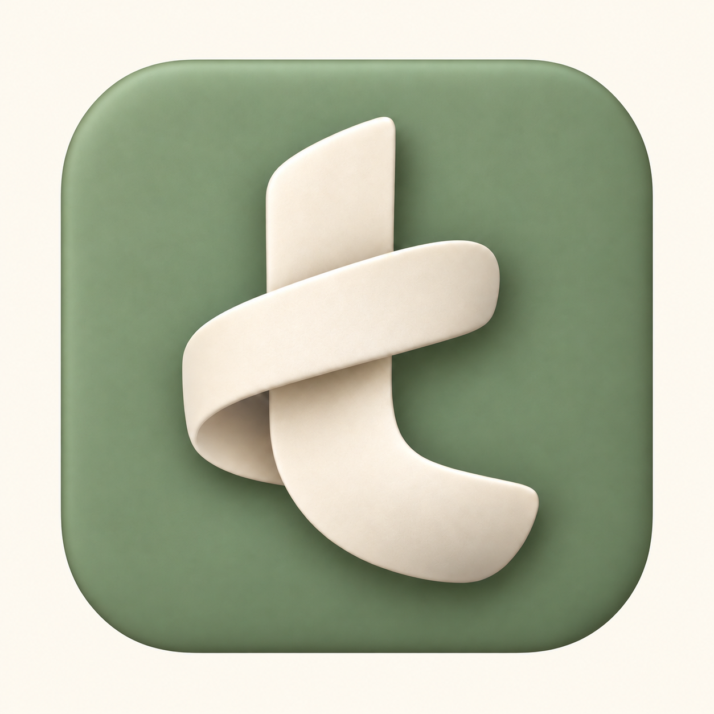
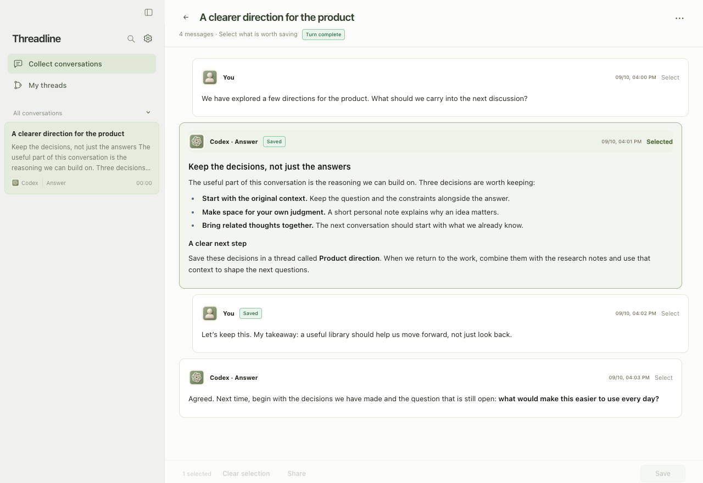
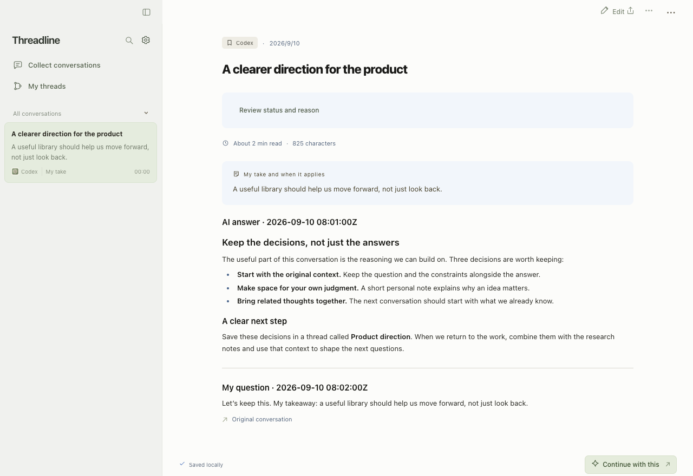

<p align="center">
  
</p>

<h1 align="center">Threadline</h1>

<p align="center"><strong>Carry your thinking forward.</strong></p>

<p align="center">
  A local home for the ideas, decisions, and context in your AI conversations.<br>
  Keep what matters. Add your perspective. Pick up where you left off.
</p>

<p align="center">
  <a href="#quick-start">Quick start</a> ·
  <a href="#how-it-works">How it works</a> ·
  <a href="docs/agent-runtime.md">Agent integration</a> ·
  <a href="#documentation">Documentation</a> ·
  <a href="https://github.com/rsgok/Threadline/issues">Issues</a>
</p>

<p align="center"><strong>English</strong> · <a href="README.zh-CN.md">简体中文</a></p>

<p align="center"><sub>macOS 13+ · Local storage · Codex &amp; Cursor · Early development</sub></p>



<p align="center"><sub>The current app interface, shown with an example conversation.</sub></p>

## Why Threadline?

An AI conversation can move your work forward: a design decision, a useful explanation, a direction you finally agree on. But the next conversation often starts with searching the history and explaining it all again.

Threadline gives that work somewhere to continue. Save the messages that matter with their original context, add what you think, and bring the relevant notes into your next discussion.

It works alongside your AI tools. You decide what belongs in your library and what to carry forward.

## How it works

### 1. Keep the useful part

Browse local **Codex** and **Cursor Agent** conversations. Select specific messages and save them with source references and available project context. Supported local images and files can be copied into your library with the note.

### 2. Make the thinking yours

Read the original words, add your own take, and organize related notes into threads. Search your library when you need to return to a decision. Mark a note as outdated or updated, with a reason, as your understanding changes.

### 3. Start the next conversation further along

Combine notes and copy them into your next AI chat. Export Markdown and attachments, turn selected messages into image cards, or share a discussion through Feishu, Slack, or Discord.

<details>
<summary><strong>See the saved-note view</strong></summary>



</details>

## Built around your workflow

| Capability | What you can do |
| --- | --- |
| **Mac app** | Browse a two-pane library, read and edit notes, resize or collapse the sidebar. |
| **Runtime sidebar** | Keep Threadline close to the conversation you are working in. |
| **Original context** | Retain source messages, references, and project details when available. |
| **Local library** | Store notes and saved attachments on your Mac; export Markdown in a ZIP. |
| **Sharing** | Copy text, export files and PNG cards, or send selected content to a connected service. |
| **Skill + CLI** | Let an agent save, find, and reuse notes through the same local service. |

The app supports English and Simplified Chinese. Choose a language in **Settings**; the initial choice follows your system language.

## Quick start

Threadline currently installs **from source**. The Mac app uses your local Node.js installation; a standalone installer is not available yet.

### Requirements

- **macOS 13 or later**
- **Node.js 22.13 or later** and npm
- **Swift 5.9 or later**, available through Xcode or Xcode Command Line Tools
- **Python 3**, used by the installation scripts and optional CLI

### Install the Mac app

```sh
git clone https://github.com/rsgok/Threadline.git
cd Threadline
npm ci
bash scripts/install-mac.sh
open "$HOME/Applications/Threadline.app"
```

The installer starts the local service, builds the app, and installs it into `~/Applications/Threadline.app`. The web interface is also available at [127.0.0.1:43127](http://127.0.0.1:43127).

### Add Threadline to Codex

```sh
bash scripts/install-skill.sh
```

Start a new Codex session and use `$threadline` to open Threadline for the current conversation. For CLI setup and other agent runtimes, see the [agent integration guide](docs/agent-runtime.md).

### Save your first conversation

1. Open **Collect conversations** and choose a local Codex or Cursor conversation.
2. Select the messages you want to keep, then choose **Save**.
3. Open the saved note, add your perspective, and use **Continue with this** when you are ready for the next discussion.

## Your data, on your Mac

Your library lives in `~/Library/Application Support/RewindWeb`. The directory name is retained for compatibility with earlier versions.

- Notes and threads are stored in a local SQLite database.
- Recognized local attachments can be saved as copies; remote images remain links.
- Sharing sends content only when you confirm a send to a connected service.
- ZIP exports include Markdown and saved attachments so your work can leave the app.

See [local data and backups](docs/local-data.md) for storage details, attachment limits, and migration behavior.

## Current scope

- Conversation collection reads **local Codex and Cursor Agent transcripts**. It does not download cloud history or recover older Cursor IDE databases.
- The Mac app currently requires a source build and an installed Node.js runtime.
- PNG card export downloads its Chromium rendering component on first use. Once installed, rendering runs locally.
- Feishu, Slack, and Discord require their own connection setup. Feishu also requires `lark-cli` on the local machine.

## Documentation

| Guide | Contents |
| --- | --- |
| [Agent integration](docs/agent-runtime.md) | Install the CLI and skill; connect other runtimes; save and reuse notes. |
| [Local data and backups](docs/local-data.md) | Storage, exports, attachment handling, and safe backups. |
| [Development](docs/development.md) | Run from source, validate changes, and understand the project layout. |
| [Sharing guide — 简体中文](docs/sharing.md) | Configure sharing destinations, image cards, limits, and retry behavior. |
| [Interface languages](docs/i18n.md) | Language preferences and translation conventions. |

## Contributing

Bug reports, workflow feedback, and focused pull requests are welcome. [Open an issue](https://github.com/rsgok/Threadline/issues) with the behavior you expected, what happened, and steps to reproduce it. Use sample conversations when reporting a problem.

Before changing the app, read [AGENTS.md](AGENTS.md) and the [development guide](docs/development.md). Keep the English and Chinese READMEs aligned when changing product claims or installation instructions.

## License

Threadline is licensed under the [Apache License 2.0](LICENSE). Third-party dependencies retain their respective licenses.
